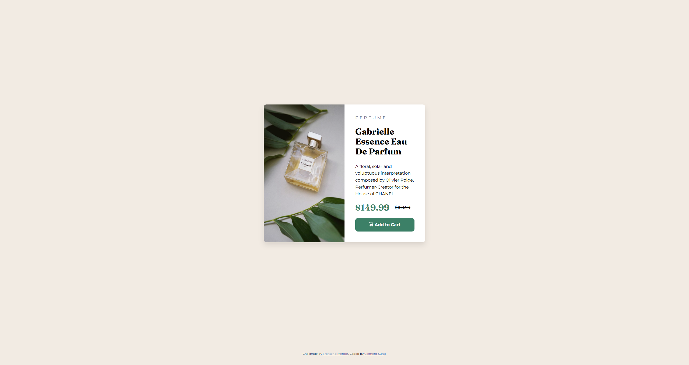

# Frontend Mentor - Product preview card component solution

This is a solution to the [Product preview card component challenge on Frontend Mentor](https://www.frontendmentor.io/challenges/product-preview-card-component-GO7UmttRfa). Frontend Mentor challenges help you improve your coding skills by building realistic projects. 

## Table of contents

- [Overview](#overview)
  - [The challenge](#the-challenge)
  - [Screenshot](#screenshot)
  - [Links](#links)
- [My process](#my-process)
  - [Built with](#built-with)
  - [What I learned](#what-i-learned)
  - [Continued development](#continued-development)
  - [Useful resources](#useful-resources)
- [Author](#author)


## Overview

### The challenge

Users should be able to:

- View the optimal layout depending on their device's screen size
- See hover and focus states for interactive elements

### Screenshot



### Links

- Solution URL: [Solution](https://www.frontendmentor.io/solutions/product-preview-card-with-flexbox-clamp-and-media-queries-yj9PRSpTXG)
- Live Site URL: [Product Preview Card](https://clembrulee.github.io/product-preview-card/)

## My process

### Built with

- Semantic HTML5 markup
- CSS custom properties
- Flexbox
- Mobile-first workflow


### What I learned

I learned to use the media queries to hide the respective desktop/mobile images based on the min/max-width. Also, learned to use clamp on the width for the responsive design of the product card. 

```css
@media screen and (max-width: 768px) {
  .card-image-desktop {
    display: none;
  }
}

@media screen and (min-width: 769px) {
  .card-image-mobile {
    display: none;
  }
  .product-card {
    display: flex;
    flex-direction: row;
    max-width: 80vw;
    margin: 0 auto;
  }

  .card-image-container img {
    border-top-left-radius: 10px;
    border-bottom-left-radius: 10px;
    width: 100%;
  }

  .card-image-container {
    width: 50%;
  }

  .card-text-content {
    width: 50%;
    padding: 40px;
  }
}
```


### Continued development

Continue to learn more CSS techniques to improve efficiency and to create seamless responsive designs. 

### Useful resources

- [Clamp resource](https://www.marcbacon.com/understanding-clamp//) - This helped me with learning about clamp. 


## Author

- Website - [Clement Sung](https://github.com/clembrulee)
- Frontend Mentor - [@clembrulee](https://www.frontendmentor.io/profile/clembrulee)
